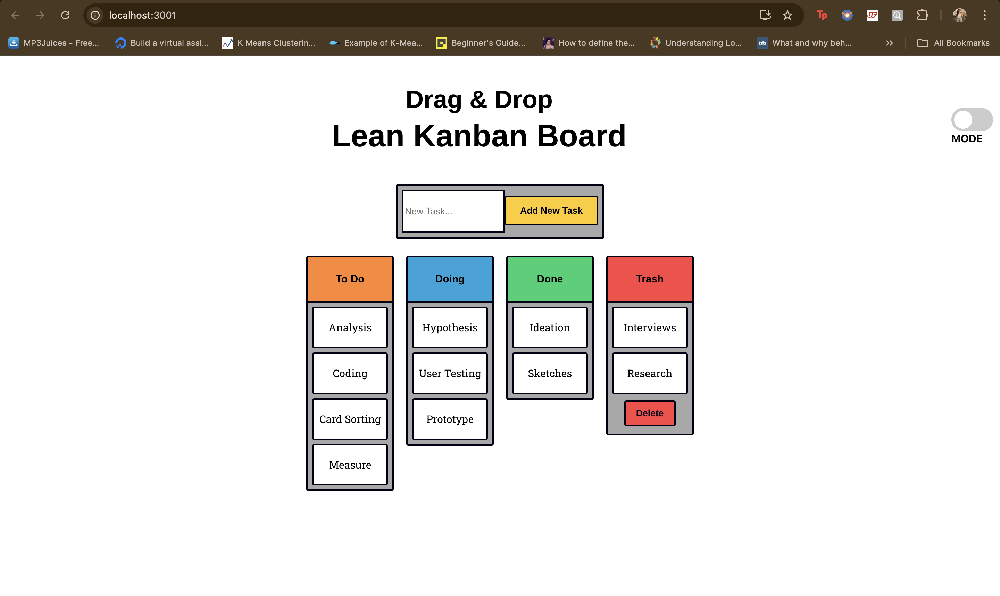
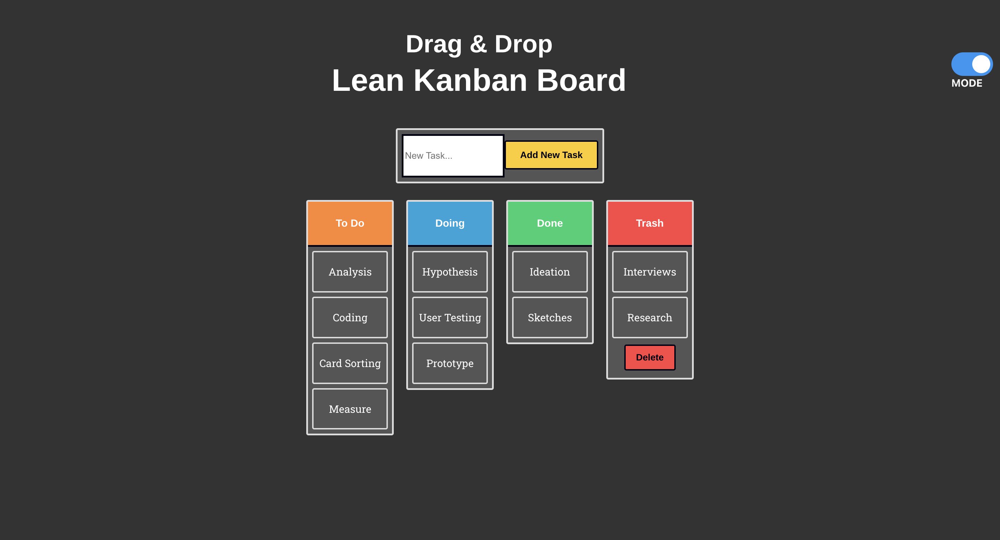

# Kanban Board Tool

## Overview

The Kanban Board Tool is an interactive web application that allows users to manage tasks using a drag-and-drop interface. It includes features for adding and deleting tasks, switching between light and dark themes, and providing a responsive user interface. It is built using React and JavaScript.

## Features

- Drag and drop tasks between columns
- Add new tasks to the "To Do" column
- Delete tasks in the "Trash" column
- Toggle between light and dark themes
- Responsive design optimized for various screen sizes

## Screenshots

### Kanban Board
- Light Mode


- Dark Mode


## Technologies Used

- **Frontend**: React.js, Dragula (for drag-and-drop functionality), CSS
- **Other Tools**: GitHub (for version control)

## Setup

### Prerequisites

- Node.js and npm installed on your machine

### Installation

1. **Clone the repository**

   ```sh
   git clone https://github.com/your-username/kanban-board.git
   cd kanban-board

2. **Install dependencies**

   ```sh
   npm install

3. **Running the Application**

   ```sh
   Start the development server
   npm start


## Usage
- Open your web browser and navigate to http://localhost:3000.
- Add a new task by entering it in the input field and clicking the "Add" button.
- Drag and drop tasks between the "To Do", "Doing", "Done", and "Trash" columns.
- Delete all tasks in the "Trash" column by clicking the "Delete" button.
- Toggle between light and dark themes using the switch located to the right of the header.

## License
This project is licensed under the MIT License. See the LICENSE file for details.


